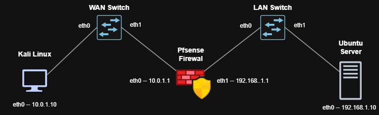
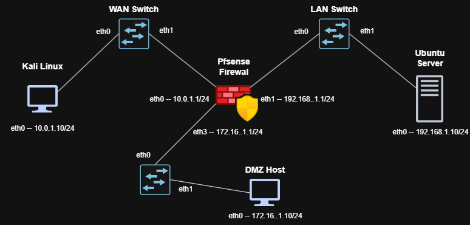

# Firewall Lab — Design & Component Setup

This document covers **why** the lab is built this way and **how to build each VM**, up to the point where it's ready to be dropped into GNS3. Building the GNS3 topology itself (wiring, IPs-in-context, testing) is a separate follow-on document.

---

## 1. Design approach

### Goal
Practice firewall concepts (rules, NAT, logging, rule ordering, scanning/evasion) against a real, stateful firewall — pfSense — in a network topology with genuine routing between segments, rather than everything sharing one flat virtual switch.

### 1.1 GNS3 — What it is, why it's here, and how to install it

### What GNS3 is
GNS3 (Graphical Network Simulator-3) is free, open-source network-emulation software. It provides a canvas where you drag on virtual devices — routers, switches, clouds, and VMs from hypervisors like VirtualBox or VMware — and wire them together with virtual cables, exactly like a network diagram. GNS3 doesn't run the devices itself; it orchestrates other tools that do (VirtualBox, in this lab) and manages the virtual wiring between them, plus starting/stopping nodes from one place.

### Where it fits in this lab's design approach
Everything in this lab could technically run as standalone VirtualBox VMs on one flat internal network. GNS3 is the layer that turns that into an actual **topology** — Kali on one segment, pfSense sitting between two segments, the server on another — so that "traffic from the attacker has to pass through the firewall" is structurally true, not just something you assume because of how IPs were assigned. It's the orchestration/wiring layer, not a separate hypervisor; VirtualBox still does the actual work of running each VM.

### Installation
1. Download the Windows installer from https://www.gns3.com/software (free account required)
2. Run the installer. Recommended component selection for this lab:
   - ✅ GNS3 (core app)
   - ✅ Npcap/WinPcap (needed for Wireshark integration and Cloud-node bridging)
   - ✅ Wireshark (useful for packet capture on GNS3 links)
   - ⬜ SPICE (only needed for QEMU-based appliances — not used here, since all nodes are VirtualBox VMs)
   - ✅ Solar-PuTTY (optional SSH client — skip if you already have one you prefer)
   - ⬜ GNS3 VM import (skip — see below)
3. On first launch, choose **"Run everything locally"** rather than importing the separate GNS3 VM. The GNS3 VM exists mainly for appliances needing a Linux environment (e.g. Cisco IOS images); since every node here already runs directly in VirtualBox, it adds an unnecessary extra layer.
4. Confirm the local server is actually running before proceeding — check the system tray icon, or browse to `http://localhost:3080/v2/version` (should return version info, not a connection error).
5. Edit → Preferences → VirtualBox → confirm the path to `VBoxManage.exe` is correct (typically `C:\Program Files\Oracle\VirtualBox\VBoxManage.exe`) — if blank or wrong, GNS3 can't query VirtualBox for VM lists at all.

### 1.2 Comparative study — GNS3 vs. alternatives

| Tool | What it's for | Fit for this lab |
|---|---|---|
| **GNS3** | Topology-based network emulation, orchestrates real hypervisors (VirtualBox/VMware/QEMU) and real OS images | **Chosen** — free, integrates directly with VirtualBox, supports real firewall/OS images rather than simplified models |
| **VirtualBox alone (no orchestrator)** | Runs VMs with manually configured internal/host-only networks | Works for 2-3 VMs on a flat network, but no visual topology, and VirtualBox-level adapter settings don't compose well once multiple VMs need coordinated wiring — exactly the friction hit repeatedly in this lab before settling on GNS3 |
| **Docker** | Lightweight containers sharing the host kernel | Good for learning `iptables`/`nftables` *syntax*, but containers share a kernel and simplified virtual networking — not realistic for testing real routing, NAT, or a stateful firewall's behavior between distinct segments |
| **EVE-NG** | Similar topology-based emulator to GNS3, popular in enterprise/CCNA-style training, generally considered to have a more polished web UI | A reasonable alternative; historically has leaned more toward a Linux-server-hosted deployment (web-based access) versus GNS3's simpler "install and run locally on Windows" model used here. Worth considering if this lab later grows into something with many more nodes or vendor router images |
| **Cloud VPS (DigitalOcean/Linode/etc.)** | Real public IP, real internet-facing traffic | Great for a later phase (seeing genuine unsolicited internet traffic hit your rules), but not a topology tool — complements GNS3 rather than replacing it |
| **GNS3 VM (separate downloadable appliance)** | Runs the GNS3 server inside a dedicated Linux VM instead of locally | Mainly useful for vendor appliances needing a Linux environment (Cisco IOS, etc.) — unnecessary overhead here since VirtualBox already runs every node directly |

**Bottom line for this lab:** GNS3 running locally (not the GNS3 VM) with VirtualBox as the backing hypervisor is the right balance of realism and simplicity — more structurally honest than a flat VirtualBox network, far more realistic than Docker, and lighter-weight than standing up EVE-NG or a full cloud environment for what's currently a 3-node topology.


### 1.3 Phase 1 - Three VMs with rationale

| VM | Role | Why this choice |
|---|---|---|
| **Kali Linux** | Attacker / test client | Comes with `nmap`, `nc`, `curl`, and other tools pre-installed, saving setup time. Has a full desktop, so its own browser can also be used if needed. |
| **pfSense CE** | Firewall under test | Free, real production-grade firewall software (not a toy `iptables` script) — has a proper GUI for rules/NAT/logging, which makes cause-and-effect visible while learning, and is what a lot of real-world small-business/home-lab firewalls actually run. |
| **Ubuntu Desktop** | Protected internal server + GUI access point | See below — this replaced an original Ubuntu **Server** (CLI-only) choice. |

### 1.4 Why Ubuntu Desktop, not Server (this was a design correction)
The original plan used Ubuntu Server (headless, CLI-only) as the protected "internal server" target. In practice this caused a real problem: **pfSense's GUI is only reachable from the LAN side**, and a CLI-only VM has no browser to view it with. Workarounds (text-mode browsers like `lynx`, SSH tunnels from the Windows host, bridging the host directly onto the LAN via a Cloud node) were all attempted and were each unreliable or overly complex — mainly because GNS3 takes ownership of every adapter on a VM once it's part of the topology, which broke approaches that depended on a separately-configured host-only adapter surviving alongside GNS3's management.

**Resolution:** use Ubuntu **Desktop** instead. It has a real browser (Firefox) on the LAN segment itself, so pfSense's GUI is reachable directly, with no tunneling, bridging, or text-browser workarounds needed. It also still runs any server-style software (nginx, openssh-server, vsftpd, etc.) needed for the actual firewall-rule exercises — the GUI is additive, not a replacement for its role as a test target.

### 1.5 Network design




| VM | Interface | IP | Notes |
|---|---|---|---|
| Kali | eth0 | `10.0.1.10/24` | static |
| pfSense | em0 (WAN) | `10.0.1.1/24` | static, faces Kali |
| pfSense | em1 (LAN) | `192.168.1.1/24` | default pfSense LAN subnet, kept as-is deliberately (matches every guide, no downside since it's isolated) |
| Ubuntu Desktop | enp0s3 (or similar) | `192.168.1.10/24`, gateway `192.168.1.1` | static |

### A general pattern worth knowing before you start
Across this whole build, the same category of problem showed up repeatedly: **a setting made directly in VirtualBox gets silently overridden once GNS3 starts managing a VM's adapters.** The practical rule that emerged: do any one-off VirtualBox-level networking (temporary internet access for installs/updates, etc.) **only while the VM is started directly from VirtualBox, never through GNS3**, and fully power off before switching back and forth. Once a VM is wired into the GNS3 topology, GNS3 owns its adapters — don't expect VirtualBox-level adapter settings to persist through a GNS3-managed session.

---
## 2. Recommended folder layout:

- **D:\VirtualLab**
  - **ISOs**
    - pfSense-CE-2.8.1-RELEASE-amd64.iso
    - kali-linux-...iso
    - ubuntu-desktop-...iso
  - **VirtualBox VMs** ← VirtualBox's default VM storage location
    - pfSense-Firewall
    - Ubuntu-Desktop
    - Kali
  - **GNS3** ← GNS3 project files, separate from this

One practical note: avoid OneDrive/Dropbox-synced folders for the ISOs directory if you can — large files there can trigger sync conflicts or slow VM creation if the file's mid-upload/download when VirtualBox tries to mount it.

---

## 3. Before you start — shared VirtualBox settings

These VirtualBox-level fixes came out of real problems hit during setup and apply to **all three VMs**, not just one:

- **Adapter Type: Intel PRO/1000 MT Desktop (82540EM)** — the default adapter type is not reliably detected by FreeBSD (pfSense) and cause issues elsewhere too. Set this explicitly on every adapter, on every VM, rather than trusting the default.
- **Storage controller: SATA** — avoids very slow installs (IDE emulation caused an install to appear "stuck" for 10+ minutes).
- **System → Motherboard → Enable I/O APIC**: checked.
- **System → Processor → Enable Nested Paging**: checked.


---

## 3.1. Kali Linux setup

**Source:** Offensive Security/Kali provides pre-built .ova files specifically for VirtualBox: Download `.ova` image — `https://www.kali.org/get-kali/#kali-virtual-machines`.

**Steps:**
1. Download the VirtualBox usually a `.7z` archive containing an `.ova`.
2. VirtualBox → **File → Import Appliance** → point at the `.ova` → import.
3. Apply the shared settings from Section 2 (adapter type, storage controller, etc.) if not already set by the import.
4. Boot it once directly in VirtualBox to confirm it comes up normally.
5. Shut down, then set its network adapter to **Not attached** in VirtualBox — GNS3 will wire it once it's part of the topology.

No install/eligibility-check quirks here since it's a pre-built image — this is the most straightforward of the three VMs.

---

## 3.2. pfSense setup

**Source:** pfSense **CE** (Community Edition — free), latest release, AMD64 ISO — `https://www.pfsense.org/download/` (requires a free Netgate account to download).

### VM creation
1. VirtualBox → New: Type **BSD**, Version **FreeBSD (64-bit)** — must be the 64-bit variant explicitly.
2. RAM: **2048 MB** minimum (1024 MB or less can cause a `panic: could not malloc` boot error).
3. Apply the shared settings from Section 2.
4. Two network adapters, both **enabled**, both set to **Intel PRO/1000 MT Desktop**:
   - Adapter 1 → temporarily **NAT** (needed for the installer's online eligibility check, see below)
   - Adapter 2 → **Not attached** for now (will also become NAT temporarily if needed, or just stays unattached until GNS3 wiring)

### Installation gotchas
- **Online eligibility check:** recent pfSense installers contact Netgate's servers during install and fail with "cannot connect to the Netgate installer" if the VM has no internet access. This is why Adapter 1 needs to be NAT (not "Not attached") *during install*.
- **Don't power off mid-install even if it looks stuck** — pfSense installs can pause for a long time (10+ minutes) at certain steps and look frozen but aren't. Powering off mid-write corrupts the installed filesystem (symptoms: `mountroot>` / kernel `db>` prompts, or missing `/boot/entropy` and `/etc/hostid` on next boot) and requires a full reinstall.
- **Remove the ISO** from the virtual optical drive once install completes, before the final reboot, so it doesn't boot back into the installer.

### Interface assignment (console menu)
On first boot to the installed system, you land on pfSense's numbered console menu.

1. **Option 1 — Assign Interfaces**: assign WAN → `em0`, LAN → `em1`. If a second interface doesn't show up as an option, it usually means Adapter 2 isn't actually enabled/detected yet — go back into VirtualBox, confirm it, and reboot.
2. **Option 2 — Set interface IP address** → LAN:
   - Static, not DHCP
   - IP: `192.168.1.1`, subnet: `24`
   - No gateway (LAN doesn't need one)
   - Skip IPv6
   - DHCP server on LAN: optional, either works for this lab
   - Keep HTTPS for the web GUI (don't revert to HTTP)
3. WAN can be left unconfigured for now — its real IP (`10.0.1.1/24`) gets set once it's wired to Kali's segment in GNS3, or can be pre-set the same way as LAN if you'd rather do it now.

### Before handing off to GNS3
1. Shut the VM down completely.
2. Set **both adapters to "Not attached"** in VirtualBox (removes the temporary NAT used for install).
3. Confirm Adapter Type is still Intel PRO/1000 MT Desktop on both.

### Known default behavior worth expecting (not a bug)
pfSense's **WAN** interface blocks essentially everything inbound by default (including ICMP/ping) — this is intentional, production-accurate firewall behavior, and the first real exercise once the topology is wired is adding a rule to allow specific traffic through.

---

## 3.3. Ubuntu Desktop setup

**Source:** Ubuntu Desktop 26.04 LTS — `https://ubuntu.com/download/desktop`.

### VM creation
1. VirtualBox → New: Type **Linux**, Version **Ubuntu (64-bit)**.
2. RAM: **4096 MB** (desktop needs more than a headless server would).
3. 2 CPU cores.
4. Disk: 25 GB, dynamically allocated.
5. Apply the shared settings from Section 2.
6. Video Memory: 64+ MB (desktop rendering needs more than the default).
7. One network adapter, **NAT** temporarily (for install + package downloads), Intel PRO/1000 MT Desktop.

### Installation
1. Boot the ISO, choose **Install Ubuntu**.
2. Normal installation, with updates and third-party software (fine, since NAT gives internet access).
3. Erase disk and install (safe — fresh virtual disk).
4. Set username/password/hostname.
5. Remove the ISO before the final reboot.

### Setting a static IP on Ubuntu — Desktop vs. Server

Ubuntu Desktop uses NetworkManager as the thing actually managing connections day-to-day; Netplan there is just a thin pass-through (`renderer: NetworkManager`) that generates NetworkManager profiles. Ubuntu **Server** has no GUI and typically uses `systemd-networkd` as the renderer instead. Mixing both methods on the same VM (GUI + hand-edited Netplan) creates two competing profiles for the same adapter — pick the method that matches the VM, not both.

- **Method A — GUI (Ubuntu Desktop)**
   1. Settings → Network → gear icon next to the wired connection
   2. IPv4 tab → Method: **Manual**
   3. Add: Address `192.168.1.10`, Netmask `255.255.255.0` (= `/24`), Gateway `192.168.1.1`
   4. DNS: `192.168.1.1` (pfSense's resolver), or leave automatic
   5. Apply, then disconnect/reconnect the connection (Apply alone doesn't always push the change to the live interface)

- **Method B — Netplan directly (Ubuntu Server, or Desktop with `renderer: networkd`)**
   1. Check the interface name and existing config:
      ```bash
      ip a
      cat /etc/netplan/*.yaml
      ```
   2. Edit the file (name varies — `50-cloud-init.yaml` or similar on Server):
      ```
      sudo nano /etc/netplan/00-installer-config.yaml
      ```
   3. Set it to static — indentation must be **spaces only, consistent per level** (mixing tabs/spaces or misaligning `to:`/`via:` causes an "inconsistent indentation" error):
      ```yaml
      network:
      version: 2
      ethernets:
         enp0s3:
            dhcp4: false
            addresses:
            - 192.168.1.10/24
            routes:
            - to: default
               via: 192.168.1.1
            nameservers:
            addresses: [192.168.1.1, 8.8.8.8]
      ```
   4. Validate before applying (no output = valid syntax):
      ```bash
      sudo netplan generate
      ```
   5. Apply:
      ```bash
      sudo netplan apply
      ```
   6. Verify:
      ```bash
      ip a
      ping -c 4 192.168.1.1
      ```

   **If both methods were used on the same Desktop VM and now conflict** (duplicate/competing profiles, IP not updating):
   1. `nmcli connection show` — look for both a manual GUI profile and an auto-generated `netplan-<interface>-...` entry
   2. Delete the Netplan-generated one: `sudo nmcli connection delete "netplan-enp0s3"` (use the exact name shown)
   3. Reset the Netplan file back to the minimal Desktop default so it stops generating a competing profile:
      ```yaml
      network:
      version: 2
      renderer: NetworkManager
      ```
   4. `sudo netplan apply`, then re-verify with `nmcli connection show` and `ip a`

   **Note on the earlier DHCP lease:** switching from DHCP (`192.168.1.100`) to static (`192.168.1.10`) leaves the old lease unused in pfSense — no cleanup required, though it can be cleared from Status → DHCP Leases if desired. Any firewall rules or NAT mappings referencing `192.168.1.100` directly (rather than via an alias) need updating to the new static IP.

### Post-install: update and install lab packages
With NAT still active for internet access:
```bash
sudo apt update && sudo apt upgrade -y
```

Install what's needed for firewall-rule exercises (see the separate test-cases document for what each unlocks):
```bash
sudo apt install -y nginx openssh-server
```
(Add `vsftpd`, `bind9`, `netcat-traditional` later as needed for more advanced exercises.)

**Known gotcha:** `openssh-server` can fail to start on a fresh install with "no host keys available." Fix:
```bash
sudo ssh-keygen -A
sudo systemctl start ssh
sudo systemctl enable ssh
```

### Before handing off to GNS3
1. Shut the VM down completely.
2. Set the adapter to **Not attached**.
3. Static IP for the LAN side gets configured once it's wired in GNS3 (or can be pre-set via Netplan now — `192.168.1.10/24`, gateway `192.168.1.1` — either timing works).

---

## 4. End state before GNS3

At this point, all three VMs:
- Boot cleanly and independently in VirtualBox
- Have the shared adapter/controller settings applied
- Have their network adapters set to **Not attached**
- Kali: ready as-is
- pfSense: WAN/LAN assigned, LAN IP set to `192.168.1.1/24`
- Ubuntu Desktop: OS installed, updated, nginx + openssh-server installed and confirmed running

---

## 5. GNS3 setup

### 5.1 First-time GNS3 configuration

1. On first launch, GNS3 asks how to run its server. Choose **"Run everything locally."** The alternative (a separate downloadable GNS3 VM) is mainly useful for appliances that need a Linux environment (e.g. Cisco IOS images) — not needed here since all three lab VMs already run directly in VirtualBox.
2. Confirm the local server is actually running before going further (it's a common source of errors later, e.g. *"No available server supports this type of node"*):
   - Check for a GNS3 icon in the system tray, or
   - Edit → Preferences → Server → confirm **Local Server** shows connected, or
   - Browser check: `http://localhost:3080/v2/version` should return version info, not a connection error.
3. Edit → Preferences → VirtualBox → confirm the path to `VBoxManage.exe` is set correctly (typically `C:\Program Files\Oracle\VirtualBox\VBoxManage.exe`). If this is wrong or blank, GNS3 can't query VirtualBox for VM lists at all.

### 5.2 Register each VM as a GNS3 template

Do this once per VM, **with the VM fully powered off** (not running/saved) in VirtualBox — GNS3's detection wizard generally won't list a VM that's mid-session.

1. Edit → Preferences → VirtualBox → **VirtualBox VMs** → **New**
2. Select the VM from the list (Kali, pfSense, Ubuntu Desktop) → Finish
3. Click on the newly added template and confirm:
   - **Adapters**: matches how many NICs that VM actually has — **pfSense = 2**, **Kali = 1**, **Ubuntu Desktop = 1** (unless you add more later). If this number is wrong, GNS3 will only offer that many ports when wiring, silently hiding a second adapter even if VirtualBox has it enabled — check this explicitly rather than assuming it auto-detected correctly.
   - **Server**: should say "Main server" / "Local" — if it says "GNS3 VM" instead, change it (this mismatch causes the "No available server supports this type of node" error).
   - **Console type**: VNC is the standard choice for VirtualBox VMs in GNS3 — gives you a display window via right-click → Console on the canvas. If Console doesn't show as an option later, this is usually why; as a fallback, the VM can always be opened directly in VirtualBox Manager instead (it's the same running instance either way).

Repeat for all three VMs.

### 5.3 Create the project and place nodes

1. File → New Blank Project (e.g. name it `Firewall-Lab`)
2. From the left-hand device panel, drag onto the canvas:
   - **Kali**
   - An **Ethernet Switch** — rename to `WAN-Switch`
   - **pfSense**
   - A second **Ethernet Switch** — rename to `LAN-Switch`
   - **Ubuntu Desktop**

### 5.4 Wire the topology

Using the link tool (cable icon in the left-edge toolbar): click a device, pick the adapter/port when prompted, click the next device, pick its port.

- **Kali** → **WAN-Switch**
- **WAN-Switch** → **pfSense**, selecting **Adapter 0** (this is `em0`/WAN, per the interface assignment done in Section 4)
- **pfSense** → **LAN-Switch**, selecting **Adapter 1** (this is `em1`/LAN)
- **LAN-Switch** → **Ubuntu Desktop**

```
Kali --- WAN-Switch --- pfSense --- LAN-Switch --- Ubuntu Desktop
```

Double check pfSense's two links land on the correct adapters — it's easy to wire both to Adapter 0 by mistake. After starting the VM, `ifconfig em0` / `ifconfig em1` on the pfSense console confirms which physical link ended up where if there's any doubt.

### 5.5 Start and verify

1. Start all nodes (toolbar play button, or right-click each → Start). Give VirtualBox-backed nodes a minute to boot, same as starting them normally.
2. Right-click any node → **Console** to open its display without switching to VirtualBox Manager. If Console doesn't appear in the menu, open VirtualBox Manager directly instead and double-click the (already running) VM — same session, different window.
3. Set final static IPs per the scheme in Section 1 (Kali `10.0.1.10/24`, pfSense WAN `10.0.1.1/24` if not already set, Ubuntu Desktop `192.168.1.10/24` gateway `192.168.1.1`).
4. Verify connectivity:
   ```
   Kali → ping 10.0.1.1        (pfSense WAN)
   Ubuntu → ping 192.168.1.1   (pfSense LAN)
   Kali → ping 192.168.1.10    (server, through the firewall — expected to FAIL by default, see below)
   ```

### 5.6 Expected default-deny behavior

`Kali → pfSense WAN` traffic is blocked by default — pfSense's WAN interface denies essentially everything inbound out of the box, including ICMP. This is correct, production-accurate behavior, not a wiring problem. The first real exercise (covered in the separate test-cases document) is adding a rule to allow specific traffic through and watching that change take effect.

### 5.7 Reaching the pfSense GUI

From **Ubuntu Desktop** (on the LAN side), open Firefox and go to `https://192.168.1.1`. Accept the self-signed certificate warning, log in with `admin` / the password set during the console setup wizard (or `pfsense` if never changed).

This is the reason Ubuntu Desktop (not Server) is used as the LAN-side VM — see Section 1 for the full rationale.

### 5.8 A pattern worth remembering

Any VirtualBox-level adapter setting (NAT for temporary internet access, a host-only adapter, etc.) only behaves as expected while the VM is started **directly from VirtualBox**, not through GNS3. Once a VM is running as a GNS3 node, GNS3 owns and can reset its adapters according to the topology wiring — don't expect a VirtualBox-side change to persist into a GNS3-managed session, and don't try to mix the two for the same adapter in the same session.

## Miscellaneous. Installation issues

### pfSense

```
panic: could not malloc 98304 bytes error
```

That's a classic FreeBSD/pfSense out-of-memory panic during boot — it happens when the VM doesn't have enough RAM allocated for the kernel to initialize its internal structures (memory pools, network buffer allocations, etc.), not a corrupted ISO or bad download.

### Most common fix: 
```
bump up the VM's RAM
```

pfSense technically boots on very little RAM, but VirtualBox's virtual hardware overhead plus FreeBSD's memory allocator needs more headroom than the bare minimum suggests. Check your VirtualBox VM settings:

- Shut down the VM completely
- VirtualBox → Settings → System → Motherboard → check Base Memory
- Set it to at least 1024 MB (1 GB), ideally 2048 MB (2 GB) for comfortable use with logging/packages later

## 6. Phase 2 — Adding a DMZ

### 6.1 Why a DMZ

The topology so far only teaches "trusted vs. untrusted" (WAN vs. LAN) — allow or block. A DMZ adds a **third zone** with its own trust level, which is what most real firewall rule-writing is actually about: not just internet-vs-internal, but which internal zones can reach which other internal zones, and in which direction.

Specifically, a DMZ demonstrates **directional trust**: WAN can reach the DMZ's public-facing service, but the DMZ **cannot** initiate connections back into LAN — so if the DMZ host is compromised, it can't pivot into the real internal network. That containment property is the actual point of a DMZ, and the exercises below are built to prove it holds, not just assume it.

### 6.2 Updated network design




| VM | Interface | IP | Notes |
|---|---|---|---|
| pfSense | em2 (OPT1/DMZ) | `172.16.1.1/24` | new third interface |
| DMZ host | eth0 | `172.16.1.10/24`, gateway `172.16.1.1` | new VM — a lightweight VM is enough; doesn't need a desktop |

### 6.3 VM and VirtualBox setup

To host a lightweight web server or reverse proxy like NGINX in the DMZ, **Alpine Linux** is recommended as the primary distribution, with **Ubuntu Server** serving as a secondary alternative.

| Criterion | Primary: Alpine Linux | Secondary: Ubuntu Server |
| :--- | :--- | :--- |
| **RAM Footprint** | ~128 MB | ~1 GB |
| **Disk Footprint** | ~150 MB | ~4 GB – 5 GB |
| **Attack Surface** | Ultra-minimal (`musl`, `busybox`) | Standard server toolset |
| **Init System** | OpenRC | systemd |
| **Persist Hardening** | Supports Run-from-RAM mode | Standard persistent disk |

* **Primary (Recommended): Alpine Linux**  
  Download the Alpine "Virtual" ISO (~50 MB). Build the VM with 128 MB–256 MB RAM and a 1 GB disk. Run `setup-alpine`, install NGINX using `apk add nginx`, and manage the service with OpenRC (`rc-service nginx start`). Apply temporary NAT for updates/install, then set to *Not attached* before handing off to GNS3.

* **Secondary: Ubuntu Server (CLI-only)**  
  If Debian/`systemd` compatibility is required, build an Ubuntu Server VM using the minimal ISO. Allocate at least 1 GB RAM and an 8 GB disk. Apply the shared VirtualBox settings from Section 2, use temporary NAT for initial updates (`apt install nginx`), then set to *Not attached* before handing off to GNS3.

---
### 6.3.1 Setting Up NGINX on Alpine Linux in VirtualBox

This guide walks you through setting up a lightweight Alpine Linux server running NGINX inside VirtualBox.

- **Step 1: Download the Alpine ISO**
   1. Visit the [Alpine Linux Downloads page](https://alpinelinux.org/downloads/).
   2. Download the **Virtual** ISO (or **Standard** ISO). 
   > *Note:* The **Virtual** variant is optimized for headless VMs with a stripped-down kernel (~50–60 MB).

- S**tep 2: Create the Virtual Machine in VirtualBox**
   1. Open VirtualBox and click **New**.
   2. Configure the VM settings:
      * **Name:** `DMZ Host - Alpine Virtual`
      * **Type:** `Linux`
      * **Version:** `Other Linux (64-bit)`
      * **Base Memory (RAM):** `256 MB` (or `512 MB`)
      * **Virtual Hard Disk:** `2 GB` to `5 GB` (VDI, Dynamically Allocated)

- **Step 3: Boot and Install Alpine to Disk**

   1. Attach the downloaded Alpine ISO file under **Settings > Storage > Controller: IDE / Optical Drive**.
   2. Start the Virtual Machine.
   3. At the login prompt, type `root` and press **Enter** (no password required).
   4. Run the interactive installer script:
      ```bash
      setup-alpine
      ```
   5. Follow the configuration prompts:
      * Select your keyboard layout and variant.
      * Set a hostname (e.g., `alpine-server`).
      * Choose your network interface (usually `eth0`) and select `dhcp`.
      * Set a password for the `root` account.
      * Select your timezone.
      * Set proxy preferences (usually `none`).
      * Select an APK mirror repository (enter `f` to pick the fastest mirror automatically).
      * Choose the user setup (default or create a new user).
      * When prompted to select a disk, enter `sda`.
      * When asked **"How would you like to use it?"**, type `sys` (installs to disk permanently).
      * Type `y` to confirm erasing and formatting the disk.
   6. Once completed, shutdown the system:
      ```bash
      poweroff
      ```
   7. Remove the ISO file from VirtualBox **Storage Settings**, then power on the VM again.

- **Step 4: Install and Start NGINX**
   1. Log in to your installation as `root`.
   2. Update the package index and install NGINX using `apk`:
      ```bash
      apk update
      apk add nginx
      ```
   3. Enable NGINX to start on system boot and start the service now:
      ```bash
      rc-update add nginx default
      service nginx start
      ```
   4. Verify the service status:
      ```bash
      service nginx status
      ```
---

### 6.3.2 Add a third adapter to pfSense:

   1. Shut pfSense down completely
   2. VirtualBox → pfSense → Settings → Network → **Adapter 3**
   3. Enable it, Adapter Type: **Intel PRO/1000 MT Desktop (82540EM)**, Attached to: **Not attached** (GNS3 will wire it)
   4. In GNS3: Edit → Preferences → VirtualBox → VirtualBox VMs → pfSense template → update **Adapters** from `2` to `3`

---

### 6.4 Assign and configure the new interface in pfSense

In GNS3, adding a third interface to a pfSense virtual appliance involves adding a network adapter to the pfSense node in your topology, mapping it to your lab topology, and then assigning it inside pfSense.

- **Step 1: Add a Network Interface in GNS3**

   1. Stop the pfSense node: Right-click the pfSense node and select Stop.
   2. Delete connected links: Delete all existing links attached to the pfSense node (GNS3 requires removing links before changing adapter counts).
   3. Open configuration: Right-click the pfSense node and select Configure.
   4. Increase adapters: Go to the Network tab and increase the Adapters count from 2 to 3 (or more, depending on your needs).
   5. Save changes: Click Apply, then OK.
   6. Reconnect links: Reconnect your original WAN and LAN links, then use the Add a Link tool to connect the newly added port to your target switch/device.
   7. Start pfSense: Right-click the pfSense node and select Start.

- **Step 2. Enable and Configure the Interface**
   1. Click on **OPT1** (or navigate to **Interfaces** > **OPT1**).
   2. Check **Enable Interface**.
   3. (Optional) Change the **Description** to something recognizable (e.g., `DMZ ` or `GUEST_LAN`).
   4. Set **IPv4 Configuration Type** to **Static IPv4**.
   5. Under **IPv4 Configuration**:
      * Set **IPv4 Address** to your desired gateway IP for this subnet (e.g., `172.16.1.1`).
      * Select the subnet mask (e.g., `/24`).
   6. Click **Save** at the bottom, then click **Apply Changes**.

### 6.5 GNS3 wiring

1. Drag a new **Ethernet Switch** onto the canvas — rename to `DMZ-Switch`
2. Drag the **DMZ host** VM onto the canvas
3. Wire: **pfSense** → **DMZ-Switch**, selecting **Adapter 2** (the new third NIC, `em2`/DMZ)
4. Wire: **DMZ-Switch** → **DMZ host**

```
Kali --- WAN-Switch --- pfSense --- LAN-Switch --- Ubuntu Desktop
                            |
                       DMZ-Switch
                            |
                        DMZ host
```

