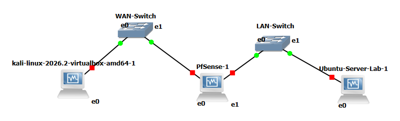

# Firewall Lab — Design & Component Setup

This document covers **why** the lab is built this way and **how to build each VM**, up to the point where it's ready to be dropped into GNS3. Building the GNS3 topology itself (wiring, IPs-in-context, testing) is a separate follow-on document.

---

## 1. Design approach

### Goal
Practice firewall concepts (rules, NAT, logging, rule ordering, scanning/evasion) against a real, stateful firewall — pfSense — in a network topology with genuine routing between segments, rather than everything sharing one flat virtual switch.

### Why GNS3 (and not just VirtualBox alone, or Docker)
- Docker containers share a kernel and simplified virtual networking — fine for learning `iptables` syntax, but not realistic for testing routing, NAT, or a real firewall's behavior between distinct network segments.
- GNS3 lets each VM's adapters be wired into an explicit topology (switches, links between named segments) rather than everything living on one flat network. This is what makes "traffic from the attacker has to pass through the firewall" actually true, not just implied.
- Everything runs on VirtualBox underneath — GNS3 is the wiring/orchestration layer, not a separate hypervisor.

### Why these three VMs

| VM | Role | Why this choice |
|---|---|---|
| **Kali Linux** | Attacker / test client | Comes with `nmap`, `nc`, `curl`, and other tools pre-installed, saving setup time. Has a full desktop, so its own browser can also be used if needed. |
| **pfSense CE** | Firewall under test | Free, real production-grade firewall software (not a toy `iptables` script) — has a proper GUI for rules/NAT/logging, which makes cause-and-effect visible while learning, and is what a lot of real-world small-business/home-lab firewalls actually run. |
| **Ubuntu Desktop** | Protected internal server + GUI access point | See below — this replaced an original Ubuntu **Server** (CLI-only) choice. |

### Why Ubuntu Desktop, not Server (this was a design correction)
The original plan used Ubuntu Server (headless, CLI-only) as the protected "internal server" target. In practice this caused a real problem: **pfSense's GUI is only reachable from the LAN side**, and a CLI-only VM has no browser to view it with. Workarounds (text-mode browsers like `lynx`, SSH tunnels from the Windows host, bridging the host directly onto the LAN via a Cloud node) were all attempted and were each unreliable or overly complex — mainly because GNS3 takes ownership of every adapter on a VM once it's part of the topology, which broke approaches that depended on a separately-configured host-only adapter surviving alongside GNS3's management.

**Resolution:** use Ubuntu **Desktop** instead. It has a real browser (Firefox) on the LAN segment itself, so pfSense's GUI is reachable directly, with no tunneling, bridging, or text-browser workarounds needed. It also still runs any server-style software (nginx, openssh-server, vsftpd, etc.) needed for the actual firewall-rule exercises — the GUI is additive, not a replacement for its role as a test target.

### Network design


```
[Kali - Attacker]  ---  [pfSense WAN | LAN]  ---  [Ubuntu Desktop - "Server"]
   10.0.1.0/24              (firewall)              192.168.1.0/24
```

| VM | Interface | IP | Notes |
|---|---|---|---|
| Kali | eth0 | `10.0.1.10/24` | static |
| pfSense | em0 (WAN) | `10.0.1.1/24` | static, faces Kali |
| pfSense | em1 (LAN) | `192.168.1.1/24` | default pfSense LAN subnet, kept as-is deliberately (matches every guide, no downside since it's isolated) |
| Ubuntu Desktop | enp0s3 (or similar) | `192.168.1.10/24`, gateway `192.168.1.1` | static |

### A general pattern worth knowing before you start
Across this whole build, the same category of problem showed up repeatedly: **a setting made directly in VirtualBox gets silently overridden once GNS3 starts managing a VM's adapters.** The practical rule that emerged: do any one-off VirtualBox-level networking (temporary internet access for installs/updates, etc.) **only while the VM is started directly from VirtualBox, never through GNS3**, and fully power off before switching back and forth. Once a VM is wired into the GNS3 topology, GNS3 owns its adapters — don't expect VirtualBox-level adapter settings to persist through a GNS3-managed session.

---

## 2. Before you start — shared VirtualBox settings

These VirtualBox-level fixes came out of real problems hit during setup and apply to **all three VMs**, not just one:

- **Adapter Type: Intel PRO/1000 MT Desktop (82540EM)** — the default adapter type is not reliably detected by FreeBSD (pfSense) and cause issues elsewhere too. Set this explicitly on every adapter, on every VM, rather than trusting the default.
- **Storage controller: SATA** — avoids very slow installs (IDE emulation caused an install to appear "stuck" for 10+ minutes).
- **System → Motherboard → Enable I/O APIC**: checked.
- **System → Processor → Enable Nested Paging**: checked.

---

## 2.1. Kali Linux setup

**Source:** official Kali VirtualBox `.ova` image — `https://www.kali.org/get-kali/#kali-virtual-machines`. Using the pre-built VirtualBox image avoids converting a VMware image and any leftover VMware-specific drivers/services.

**Steps:**
1. Download the VirtualBox `.ova`.
2. VirtualBox → **File → Import Appliance** → point at the `.ova` → import.
3. Apply the shared settings from Section 2 (adapter type, storage controller, etc.) if not already set by the import.
4. Boot it once directly in VirtualBox to confirm it comes up normally.
5. Shut down, then set its network adapter to **Not attached** in VirtualBox — GNS3 will wire it once it's part of the topology.

No install/eligibility-check quirks here since it's a pre-built image — this is the most straightforward of the three VMs.

---

## 2.2. pfSense setup

**Source:** pfSense **CE** (Community Edition — free), latest release, AMD64 ISO — `https://www.pfsense.org/download/` (requires a free Netgate account to download).

### VM creation
1. VirtualBox → New: Type **BSD**, Version **FreeBSD (64-bit)** — must be the 64-bit variant explicitly.
2. RAM: **2048 MB** minimum (1024 MB or less can cause a `panic: could not malloc` boot error).
3. Apply the shared settings from Section 2.
4. Two network adapters, both **enabled**, both set to **Intel PRO/1000 MT Desktop**:
   - Adapter 1 → temporarily **NAT** (needed for the installer's online eligibility check, see below)
   - Adapter 2 → **Not attached** for now (will also become NAT temporarily if needed, or just stays unattached until GNS3 wiring)

### Installation gotchas
- **Online eligibility check:** recent pfSense installers contact Netgate's servers during install and fail with "cannot connect to the Netgate installer" if the VM has no internet access. This is why Adapter 1 needs to be NAT (not "Not attached") *during install*.
- **Don't power off mid-install even if it looks stuck** — pfSense installs can pause for a long time (10+ minutes) at certain steps and look frozen but aren't. Powering off mid-write corrupts the installed filesystem (symptoms: `mountroot>` / kernel `db>` prompts, or missing `/boot/entropy` and `/etc/hostid` on next boot) and requires a full reinstall.
- **Remove the ISO** from the virtual optical drive once install completes, before the final reboot, so it doesn't boot back into the installer.

### Interface assignment (console menu)
On first boot to the installed system, you land on pfSense's numbered console menu.

1. **Option 1 — Assign Interfaces**: assign WAN → `em0`, LAN → `em1`. If a second interface doesn't show up as an option, it usually means Adapter 2 isn't actually enabled/detected yet — go back into VirtualBox, confirm it, and reboot.
2. **Option 2 — Set interface IP address** → LAN:
   - Static, not DHCP
   - IP: `192.168.1.1`, subnet: `24`
   - No gateway (LAN doesn't need one)
   - Skip IPv6
   - DHCP server on LAN: optional, either works for this lab
   - Keep HTTPS for the web GUI (don't revert to HTTP)
3. WAN can be left unconfigured for now — its real IP (`10.0.1.1/24`) gets set once it's wired to Kali's segment in GNS3, or can be pre-set the same way as LAN if you'd rather do it now.

### Before handing off to GNS3
1. Shut the VM down completely.
2. Set **both adapters to "Not attached"** in VirtualBox (removes the temporary NAT used for install).
3. Confirm Adapter Type is still Intel PRO/1000 MT Desktop on both.

### Known default behavior worth expecting (not a bug)
pfSense's **WAN** interface blocks essentially everything inbound by default (including ICMP/ping) — this is intentional, production-accurate firewall behavior, and the first real exercise once the topology is wired is adding a rule to allow specific traffic through.

---

## 2.3. Ubuntu Desktop setup

**Source:** Ubuntu Desktop 26.04 LTS — `https://ubuntu.com/download/desktop`.

### VM creation
1. VirtualBox → New: Type **Linux**, Version **Ubuntu (64-bit)**.
2. RAM: **4096 MB** (desktop needs more than a headless server would).
3. 2 CPU cores.
4. Disk: 25 GB, dynamically allocated.
5. Apply the shared settings from Section 2.
6. Video Memory: 64+ MB (desktop rendering needs more than the default).
7. One network adapter, **NAT** temporarily (for install + package downloads), Intel PRO/1000 MT Desktop.

### Installation
1. Boot the ISO, choose **Install Ubuntu**.
2. Normal installation, with updates and third-party software (fine, since NAT gives internet access).
3. Erase disk and install (safe — fresh virtual disk).
4. Set username/password/hostname.
5. Remove the ISO before the final reboot.

### Post-install: update and install lab packages
With NAT still active for internet access:
```bash
sudo apt update && sudo apt upgrade -y
```

Install what's needed for firewall-rule exercises (see the separate test-cases document for what each unlocks):
```bash
sudo apt install -y nginx openssh-server
```
(Add `vsftpd`, `bind9`, `netcat-traditional` later as needed for more advanced exercises.)

**Known gotcha:** `openssh-server` can fail to start on a fresh install with "no host keys available." Fix:
```bash
sudo ssh-keygen -A
sudo systemctl start ssh
sudo systemctl enable ssh
```

### Before handing off to GNS3
1. Shut the VM down completely.
2. Set the adapter to **Not attached**.
3. Static IP for the LAN side gets configured once it's wired in GNS3 (or can be pre-set via Netplan now — `192.168.1.10/24`, gateway `192.168.1.1` — either timing works).

---

## 3. End state before GNS3

At this point, all three VMs:
- Boot cleanly and independently in VirtualBox
- Have the shared adapter/controller settings applied
- Have their network adapters set to **Not attached**
- Kali: ready as-is
- pfSense: WAN/LAN assigned, LAN IP set to `192.168.1.1/24`
- Ubuntu Desktop: OS installed, updated, nginx + openssh-server installed and confirmed running

---

## 4. GNS3 setup

### 4.1 First-time GNS3 configuration

1. On first launch, GNS3 asks how to run its server. Choose **"Run everything locally."** The alternative (a separate downloadable GNS3 VM) is mainly useful for appliances that need a Linux environment (e.g. Cisco IOS images) — not needed here since all three lab VMs already run directly in VirtualBox.
2. Confirm the local server is actually running before going further (it's a common source of errors later, e.g. *"No available server supports this type of node"*):
   - Check for a GNS3 icon in the system tray, or
   - Edit → Preferences → Server → confirm **Local Server** shows connected, or
   - Browser check: `http://localhost:3080/v2/version` should return version info, not a connection error.
3. Edit → Preferences → VirtualBox → confirm the path to `VBoxManage.exe` is set correctly (typically `C:\Program Files\Oracle\VirtualBox\VBoxManage.exe`). If this is wrong or blank, GNS3 can't query VirtualBox for VM lists at all.

### 4.2 Register each VM as a GNS3 template

Do this once per VM, **with the VM fully powered off** (not running/saved) in VirtualBox — GNS3's detection wizard generally won't list a VM that's mid-session.

1. Edit → Preferences → VirtualBox → **VirtualBox VMs** → **New**
2. Select the VM from the list (Kali, pfSense, Ubuntu Desktop) → Finish
3. Click on the newly added template and confirm:
   - **Adapters**: matches how many NICs that VM actually has — **pfSense = 2**, **Kali = 1**, **Ubuntu Desktop = 1** (unless you add more later). If this number is wrong, GNS3 will only offer that many ports when wiring, silently hiding a second adapter even if VirtualBox has it enabled — check this explicitly rather than assuming it auto-detected correctly.
   - **Server**: should say "Main server" / "Local" — if it says "GNS3 VM" instead, change it (this mismatch causes the "No available server supports this type of node" error).
   - **Console type**: VNC is the standard choice for VirtualBox VMs in GNS3 — gives you a display window via right-click → Console on the canvas. If Console doesn't show as an option later, this is usually why; as a fallback, the VM can always be opened directly in VirtualBox Manager instead (it's the same running instance either way).

Repeat for all three VMs.

### 4.3 Create the project and place nodes

1. File → New Blank Project (e.g. name it `Firewall-Lab`)
2. From the left-hand device panel, drag onto the canvas:
   - **Kali**
   - An **Ethernet Switch** — rename to `WAN-Switch`
   - **pfSense**
   - A second **Ethernet Switch** — rename to `LAN-Switch`
   - **Ubuntu Desktop**

### 4.4 Wire the topology

Using the link tool (cable icon in the left-edge toolbar): click a device, pick the adapter/port when prompted, click the next device, pick its port.

- **Kali** → **WAN-Switch**
- **WAN-Switch** → **pfSense**, selecting **Adapter 0** (this is `em0`/WAN, per the interface assignment done in Section 4)
- **pfSense** → **LAN-Switch**, selecting **Adapter 1** (this is `em1`/LAN)
- **LAN-Switch** → **Ubuntu Desktop**

```
Kali --- WAN-Switch --- pfSense --- LAN-Switch --- Ubuntu Desktop
```

Double check pfSense's two links land on the correct adapters — it's easy to wire both to Adapter 0 by mistake. After starting the VM, `ifconfig em0` / `ifconfig em1` on the pfSense console confirms which physical link ended up where if there's any doubt.

### 4.5 Start and verify

1. Start all nodes (toolbar play button, or right-click each → Start). Give VirtualBox-backed nodes a minute to boot, same as starting them normally.
2. Right-click any node → **Console** to open its display without switching to VirtualBox Manager. If Console doesn't appear in the menu, open VirtualBox Manager directly instead and double-click the (already running) VM — same session, different window.
3. Set final static IPs per the scheme in Section 1 (Kali `10.0.1.10/24`, pfSense WAN `10.0.1.1/24` if not already set, Ubuntu Desktop `192.168.1.100/24` gateway `192.168.1.1`).
4. Verify connectivity:
   ```
   Kali → ping 10.0.1.1        (pfSense WAN)
   Ubuntu → ping 192.168.1.1   (pfSense LAN)
   Kali → ping 192.168.1.10    (server, through the firewall — expected to FAIL by default, see below)
   ```

### 4.6 Expected default-deny behavior

`Kali → pfSense WAN` traffic is blocked by default — pfSense's WAN interface denies essentially everything inbound out of the box, including ICMP. This is correct, production-accurate behavior, not a wiring problem. The first real exercise (covered in the separate test-cases document) is adding a rule to allow specific traffic through and watching that change take effect.

### 4.7 Reaching the pfSense GUI

From **Ubuntu Desktop** (on the LAN side), open Firefox and go to `https://192.168.1.1`. Accept the self-signed certificate warning, log in with `admin` / the password set during the console setup wizard (or `pfsense` if never changed).

This is the reason Ubuntu Desktop (not Server) is used as the LAN-side VM — see Section 1 for the full rationale.

### 4.8 A pattern worth remembering

Any VirtualBox-level adapter setting (NAT for temporary internet access, a host-only adapter, etc.) only behaves as expected while the VM is started **directly from VirtualBox**, not through GNS3. Once a VM is running as a GNS3 node, GNS3 owns and can reset its adapters according to the topology wiring — don't expect a VirtualBox-side change to persist into a GNS3-managed session, and don't try to mix the two for the same adapter in the same session.
